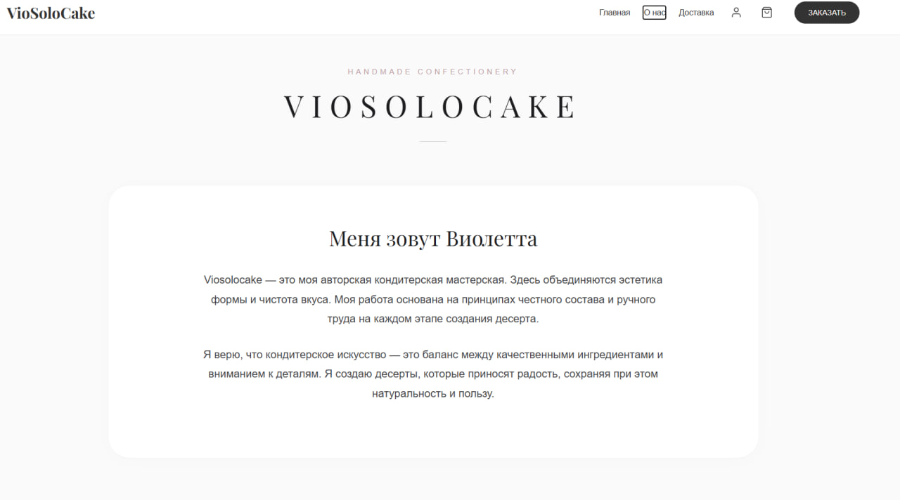
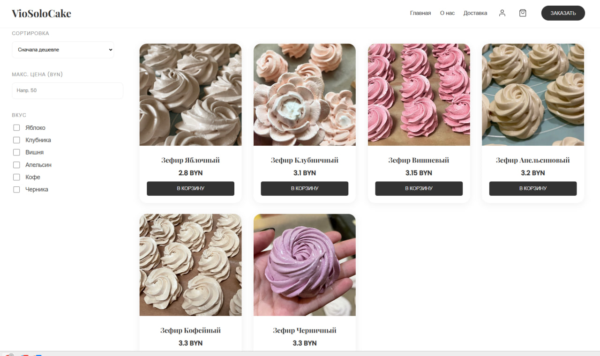
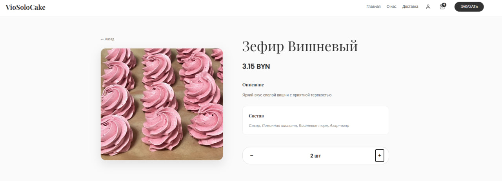
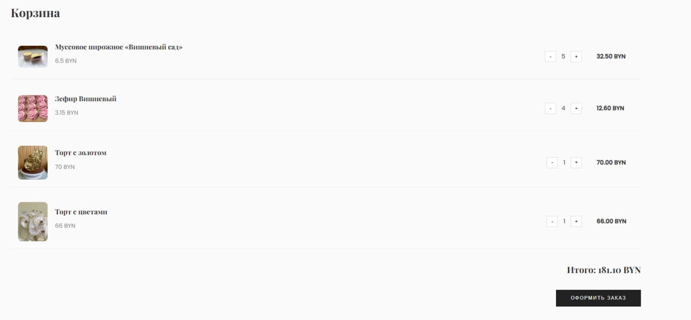
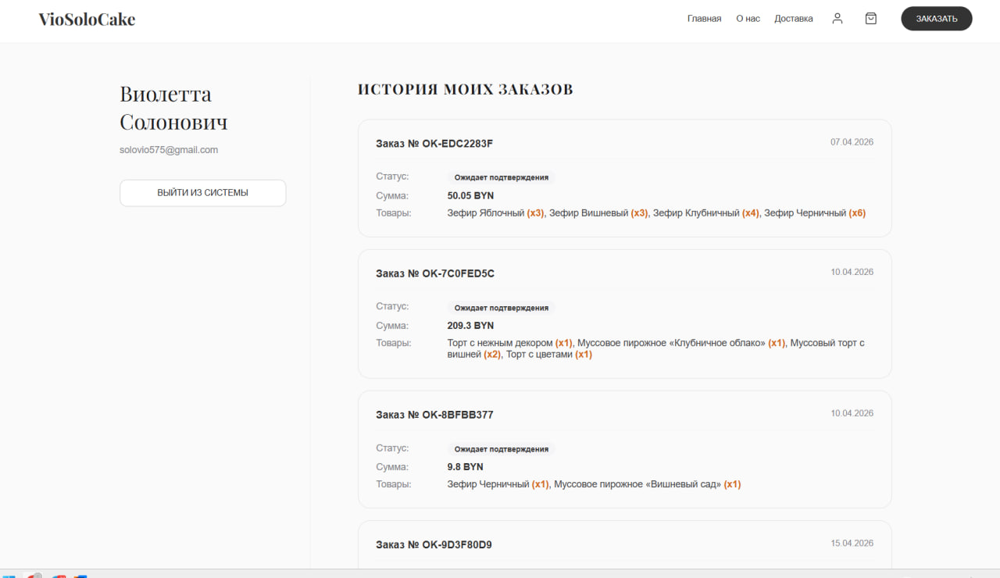
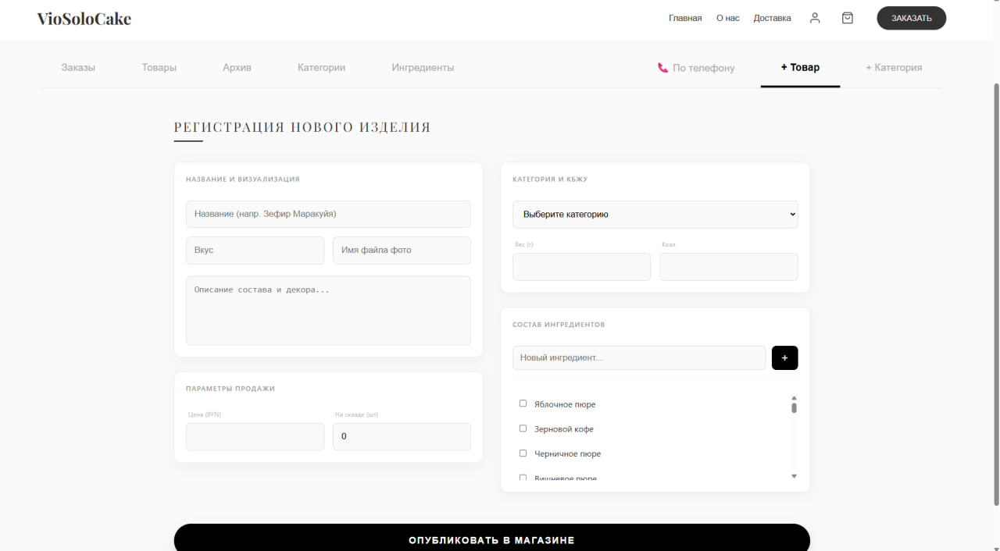
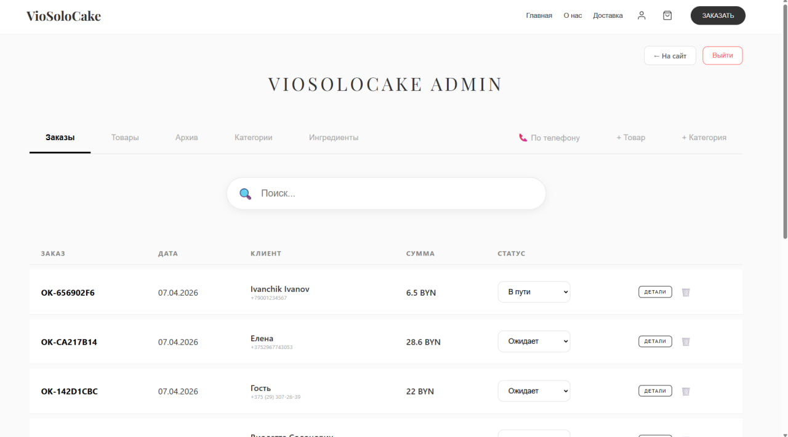
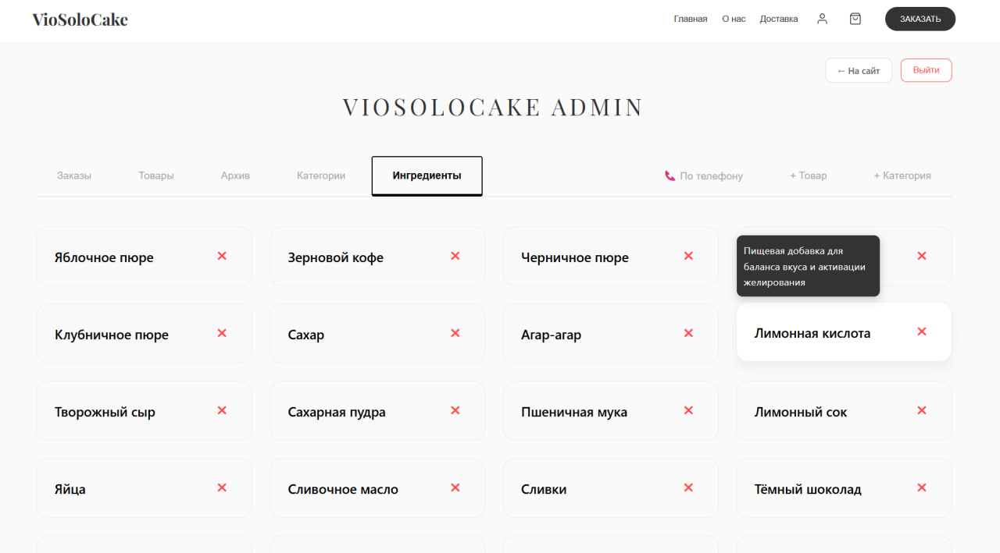
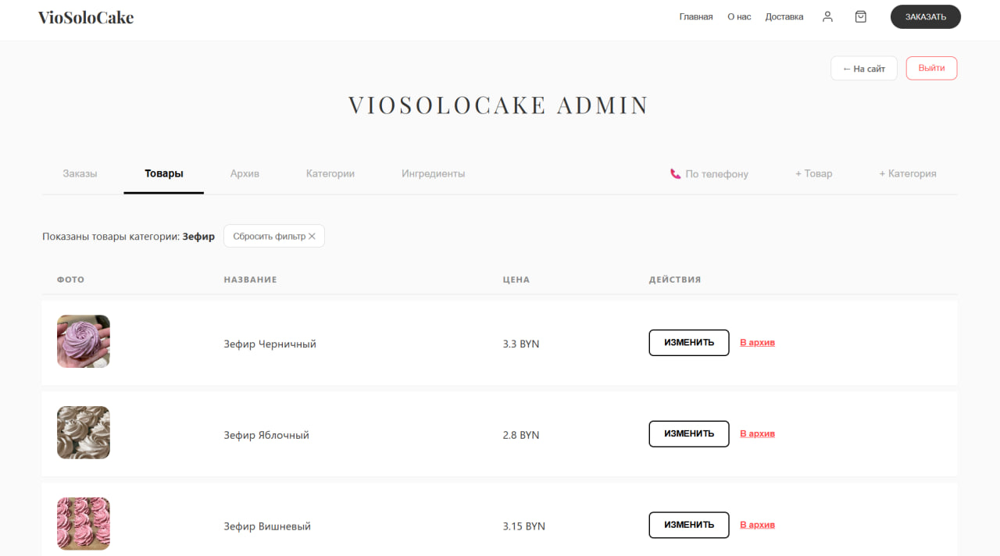

# 📖 Viosolocake API
[](https://sonarcloud.io/summary/new_code?id=viosolo_confectionery_retail)

Backend-система для управления кондитерским интернет-магазином. Проект реализован как полноценное Full-stack приложение (Java/Spring Boot + Vite) с упором на надёжную архитектуру, чистоту кода и автоматизацию процессов разработки.

---

## 🛠 Технологический стек


---

## 🏗 Архитектура и принципы разработки
Приложение спроектировано с соблюдением принципов **SOLID** и разделением ответственности по слоям:

* **Controller Layer:** Обработка HTTP-запросов, валидация входящих данных и маршрутизация.
* **Service Layer:** Реализация бизнес-логики, управление транзакциями (`@Transactional`) и координация взаимодействия компонентов.
* **Repository Layer:** Работа с БД через **Spring Data JPA**. Оптимизация запросов с использованием `JOIN FETCH` для решения проблемы N+1 и пагинации для эффективной обработки данных.
* **Mapper Layer:** Инкапсуляция логики преобразования сущностей (Entity) в **Java Records** (DTO) для обеспечения неизменяемости передаваемых данных.

**Ключевые инженерные решения:**
* **Dependency Injection:** Внедрение зависимостей через конструктор (Constructor Injection) для повышения тестируемости и поддержки immutability.
* **IoC-контейнер:** Автоматическое управление жизненным циклом бинов через ApplicationContext.
* **ORM-моделирование:** Настроенные связи `@ManyToOne` и `@ManyToMany` для обеспечения целостности данных между продуктами, категориями, ингредиентами и заказами.

---

## 🚀 DevOps и CI/CD
* **Контейнеризация:** Приложение упаковано в Docker, конфигурация `docker-compose` обеспечивает быстрое развертывание всей инфраструктуры (API + PostgreSQL).
* **CI/CD Pipeline:** Автоматизированная сборка и тестирование через **GitHub Actions**.
* **Code Quality:** Интеграция с **SonarCloud** для контроля покрытия юнит-тестами и выявления уязвимостей в коде.

---

## 📂 Интерфейс приложения
<br>

### 👤 Клиентская часть

#### О нас


<br>

#### Главная страница


<br>

#### Просмотр изделий в выбранной категории


<br>

#### Карточка товара


<br>

#### Корзина


<br>

#### Заказы профиля


<br>

---

### 🛠 Админ-панель
Реализована возможность добавления категорий и товаров, оформление заказов (в том числе по телефону), редактирование статусов заказов и управление справочником ингредиентов.

#### Добавление продукта


<br>

#### Управление заказами


<br>

#### Просмотр ингредиентов


<br>

#### Общий вид админки


<br>

#### Просмотр заказов


---

## 🚀 API Endpoints
API спроектировано в стиле **RESTful**:
* Использование стандартных HTTP-методов (GET, POST, PUT, PATCH, DELETE).
* Валидация данных и корректная обработка статус-кодов (200, 201, 204, 400, 404, 500).

---

## ⚙️ Запуск проекта

### Вариант 1: Через Docker (рекомендуется)
Этот способ автоматически запускает приложение и базу данных PostgreSQL.

1. **Подготовка базы данных:**
   Убедитесь, что у вас на компьютере установлен и запущен PostgreSQL. Создайте базу данных с названием `confectionery_db`.

2. **Настройка окружения:**
   В корне проекта создайте файл `.env`. Впишите туда данные для доступа к вашей локальной базе данных:
   ```text
   DB_USER=ваш_логин_postgresql
   DB_PASSWORD=ваш_пароль_postgresql
3. В корне проекта выполните команду:
   ```bash
   docker-compose up --build
4. Доступ:
После завершения сборки откройте в браузере:
    ```bash
    http://localhost:8080
    
### Вариант 2: Локальный запуск
Используйте этот способ для разработки и отладки напрямую через вашу IDE.

1. Убедитесь, что установлена **JDK 21** и запущен локальный инстанс **PostgreSQL**.
2. Укажите параметры подключения к базе данных в вашем конфигурационном файле (`application.properties` или `application.yml`).
3. Выполните сборку проекта:
   ```bash
   mvn clean install
4. Запустите приложение:
    ```bash
    mvn spring-boot:run
